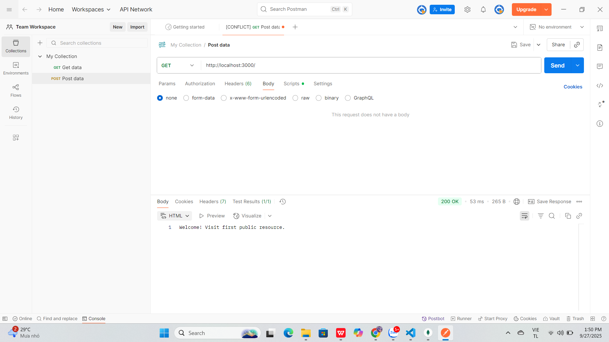
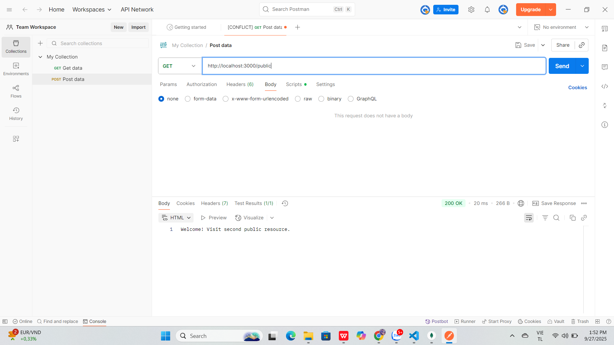
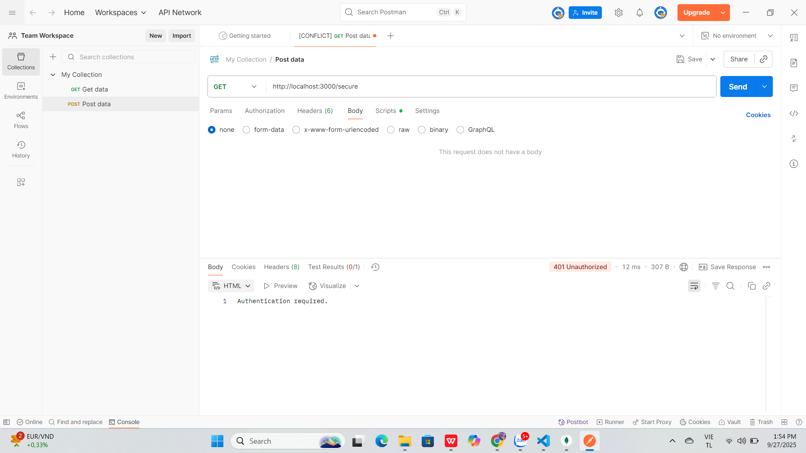
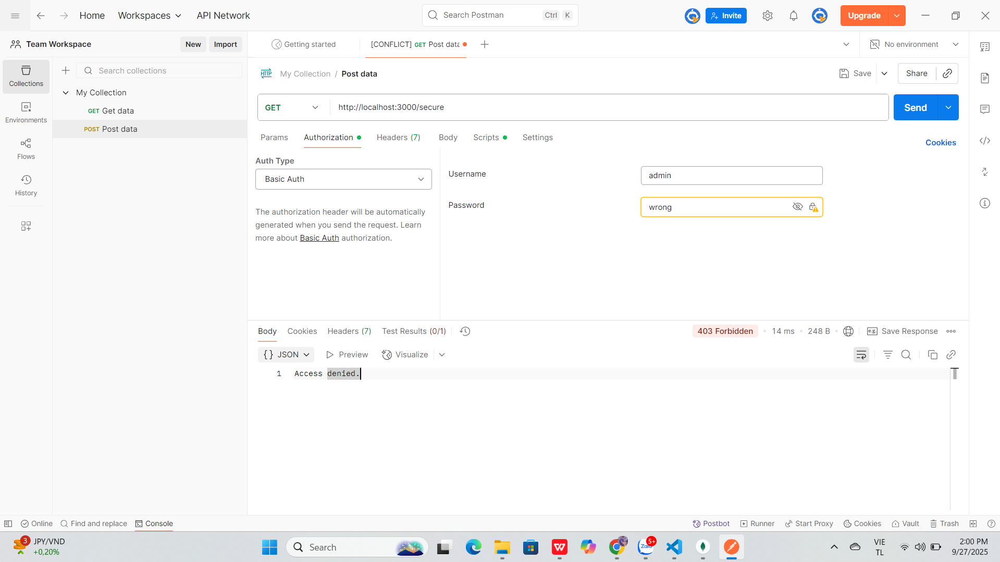
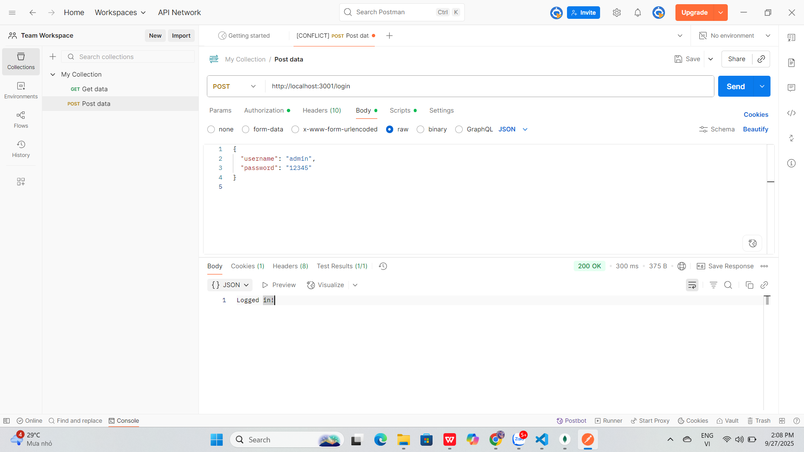
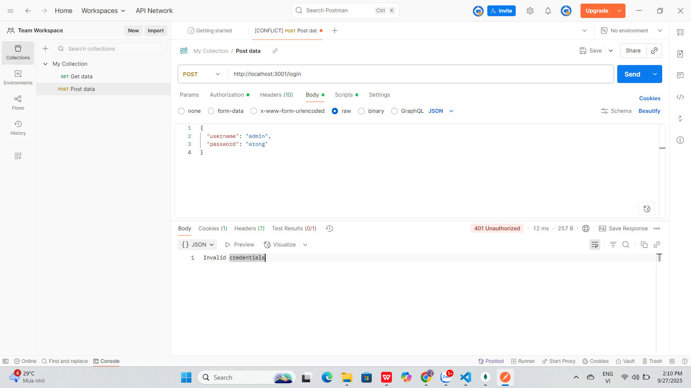
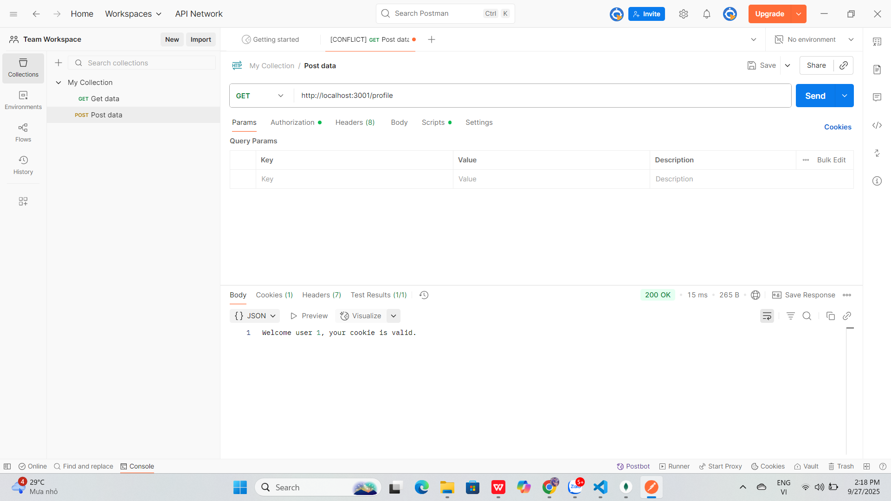
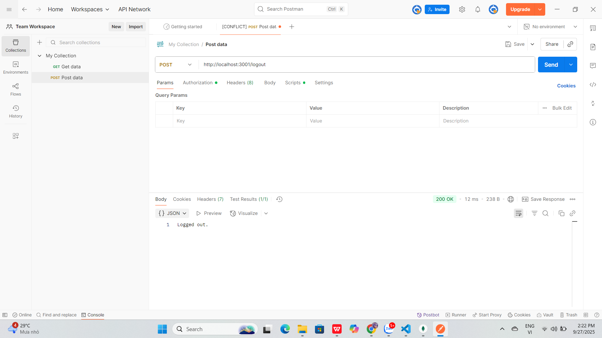
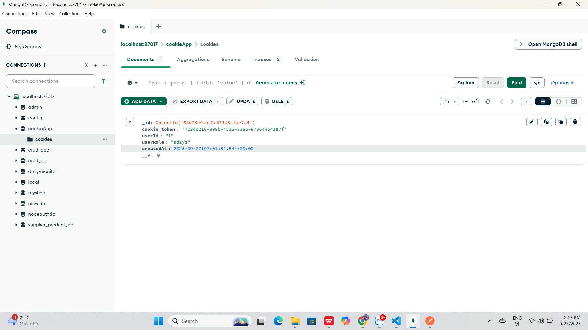

### Test kết quả Postman của basic_auth.js
### Test public /
  
### Test public /public
 
### Test secure /secure không có Auth
  
### Test secure /secure sai username/password
 
### Test secure /secure đúng username/password
  
### Test kết quả Postman của cookie_auth.js!
### Login thành công

### Login thất bại (sai password)
  
### Truy cập profile khi chưa login
  
### Truy cập profile sau khi login
  
### Test Logout
  
### xem cookie bên mongo

